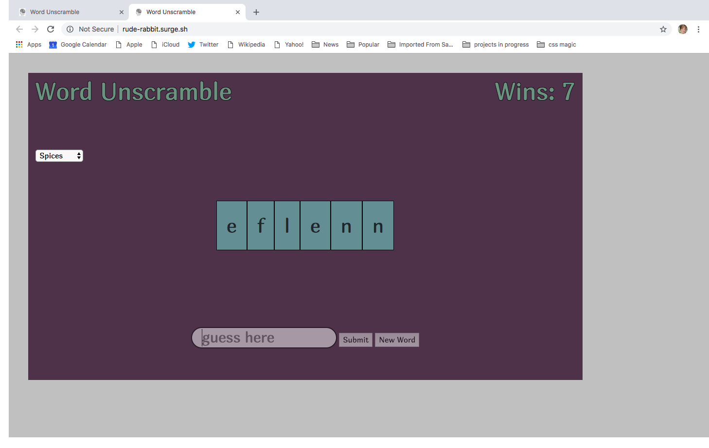

Welcome to Word Unscramble!  This game was my first project after 3 weeks of a web development course.  

The screen will display a mixed up word in tile form, and those tiles can be rearranged to help work out a solution.  Your answer should be typed in to the text field marked "guess here" and either a click of the submit button or hit enter to verify solution.  The new word button will provide solution to previous word and supply a new puzzle.

The menu on the left side can be used to change word theme, and wins are tallied in the upper right corner.

This project was developed with HTML, CSS, Bootstrap, Javascript, and Lodash

